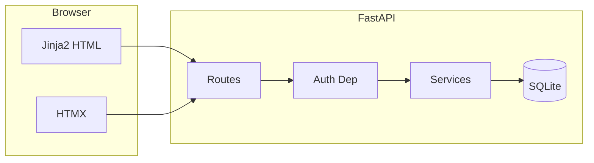

# FinanceTracker Web Application – Implementation Plan

## Tech stack

- **Backend**: FastAPI (async, Pydantic validation, OpenAPI)
- **Templates**: Jinja2 (server-rendered HTML)
- **Interactivity**: HTMX (dynamic forms, partial updates, minimal JS)
- **Database**: SQLite + SQLAlchemy 2 (ORM); easy to switch to PostgreSQL later
- **Auth**: Passlib (bcrypt) for passwords; JWT in HTTP-only cookie (or session cookie) for token-based auth; dependency for protected routes
- **Project home**: FinanceTracker

---

## High-level architecture

- **Routes**: Serve full pages (Jinja2) and HTMX partials (e.g. transaction list, filters, modals).
- **Auth dependency**: Validate JWT/session; redirect to login if unauthenticated; inject current user into handlers.
- **Services**: Business logic (user CRUD, transaction CRUD, aggregations, category checks). Keep routes thin.

---

## 1. Project layout and dependencies

- **Layout** (under `FinanceTracker/`):
  - `app/` – main package  
    - `main.py` – FastAPI app, mount routes, Jinja2 config  
    - `config.py` – settings (e.g. `SECRET_KEY`, `DATABASE_URL`)  
    - `database.py` – engine, session factory, base model, `get_db`  
    - `models/` – User, Transaction, Category (SQLAlchemy models)  
    - `schemas/` – Pydantic models for forms/API  
    - `services/` – auth, transactions, categories, insights  
    - `routers/` or `routes/` – auth, transactions, categories, insights, dashboard  
    - `templates/` – Jinja2 (base, auth, transactions, insights, categories)  
    - `static/` – CSS, minimal JS if needed
  - `requirements.txt` – FastAPI, uvicorn, sqlalchemy, passlib[bcrypt], python-jose[cryptography], jinja2, python-multipart, httpx (for HTMX-style testing if desired)
  - `.env.example` – `SECRET_KEY`, `DATABASE_URL` (optional)
  - `README.md` – run instructions
- **Config**: Load `SECRET_KEY` and `DATABASE_URL` from env; default SQLite file in project directory.

---

## 2. Authentication and user management

- **User model**: `id`, `email` (unique), `hashed_password`, `created_at`.
- **Registration**:
  - GET: Render registration form (Jinja2).
  - POST: Validate email/password (Pydantic), hash password with Passlib (bcrypt), create user, then redirect to login or auto-login and redirect to dashboard.
- **Login**:
  - GET: Render login form.
  - POST: Verify password; issue JWT (e.g. `python-jose`) with `sub=user.id` and short expiry; set token in **HTTP-only cookie** (or use session cookie); redirect to dashboard.
- **Secure password storage**: Store only `passlib.hash.bcrypt.hash(password)`; verify with `passlib.verify`.
- **Token-based auth**: Middleware or dependency that reads JWT from cookie, verifies signature and expiry, loads user, attaches to request state; on failure redirect to login.
- **Protected routes**: Apply auth dependency to all routes that require login (dashboard, transactions, insights, categories). Public routes: login, register, static assets.

---

## 3. Transactions

- **Model**: `id`, `user_id` (FK), `amount` (e.g. Decimal), `type` (enum: income/expense), `category_id` (FK), `description` (nullable), `transaction_date` (date), `created_at`, `deleted_at` (nullable, for soft delete).
- **Create**: Form with amount, type, category (dropdown from user's categories), description, transaction date. POST → validate → save; respond with redirect or HTMX partial (e.g. new row in list).
- **Read**:
  - List: Default to current user's transactions, exclude soft-deleted (`deleted_at IS NULL`).
  - **Filters**: date_from, date_to, category_id, type (income/expense); pass as query params to the same list view.
  - **Pagination**: `page`, `per_page` (e.g. 20); LIMIT/OFFSET in query; render pagination controls in template.
- **Update**: Form pre-filled with existing transaction; allow modifying amount, category, description (and type/date if required). POST/PUT to update; then redirect or return partial.
- **Delete**: Prefer **soft delete**: set `deleted_at = now()` and keep record for insights if you later want to include "deleted" in reports. Alternative: hard delete. List view always filters out soft-deleted.

---

## 4. Financial insights

- **Monthly summary** (for a given month or "current month"):
  - Total income: sum of transactions where `type=income` and in month.
  - Total expenses: sum where `type=expense` and in month.
  - Net savings: income − expenses.
  - Savings rate: (net savings / income) * 100 when income > 0.
  - Implement in a **service** (e.g. `get_monthly_summary(user_id, year, month)`); pass to Jinja2.
- **Category breakdown** (for a chosen period):
  - Group by category; total spent per category; % of total spending (expenses only). Same period filters as below.
  - Service: `get_category_breakdown(user_id, date_from, date_to)`.
- **Time-based reports**:
  - Last 30 days, last 6 months: compute `date_from`/`date_to` from today; custom range: use user-provided dates.
  - Single "insights" page with selector (e.g. "Last 30 days" / "Last 6 months" / "Custom") and optional date inputs; reuse same summary and category breakdown with different date range.

---

## 5. Category management

- **Model**: `id`, `user_id` (nullable for predefined), `name`, `is_system` or `is_predefined` (bool). Unique constraint on `(user_id, name)` (treat NULL user_id as one "system" user for predefined).
- **Predefined categories**: Seed via migration or startup script (e.g. Food, Transport, Salary, Rent, Utilities, Entertainment, Health, Other). `user_id = NULL` and `is_predefined = True`.
- **User-defined categories**: Create with current `user_id`; validate that no other category exists for that user with same name (case-insensitive if desired). Return friendly error on duplicate.
- **Listing**: Show predefined + user's own; allow "Add category" form; edit/delete only for user's own categories (predefined are read-only for delete/edit).
- **Transactions**: Dropdowns and filters use union of predefined + user categories.

---

## 6. UI and HTMX usage

- **Base template**: Common layout (nav with Dashboard, Transactions, Insights, Categories, Logout), flash messages, block content.
- **Dashboard**: Summary cards (e.g. this month's income/expenses/net) and recent transactions; links to Transactions and Insights.
- **Transactions**: Table (or cards) with filters (date range, category, type) and pagination; "Add transaction" form (page or modal); edit/delete per row. Use HTMX for: submitting filters (replace list partial), pagination (replace list), and optionally add/edit forms (swap partials) to avoid full page reloads.
- **Insights**: Select period (30 days / 6 months / custom); display monthly summary and category breakdown (tables or simple charts via CSS/HTML if no chart lib).
- **Categories**: List predefined + custom; form to add custom; validation errors shown inline.
- **Protected layout**: If JWT/session missing or invalid, redirect to login and optionally set `?next=` for post-login redirect.

---

## 7. Database and migrations

- **SQLAlchemy**: One engine and session factory; use dependency `get_db()` in routes; commit/rollback per request.
- **Migrations**: Use Alembic (or create tables in code on startup for simplicity). Include: create `users`, `categories`, `transactions`; unique on `(user_id, name)` for categories; index on `(user_id, transaction_date)` and `(user_id, deleted_at)` for performance.

---

## 8. Security and validation

- **Passwords**: Min length and complexity in Pydantic; never log or render passwords.
- **JWT**: Short expiry (e.g. 24h); secure cookie; HTTPS in production.
- **CSRF**: Use CSRF tokens on all state-changing forms (e.g. Starlette CSRF middleware or manual token in forms).
- **Input**: Validate amount > 0; dates in reasonable range; category and type from allowed enums.

---

## 9. Implementation order (suggested)

1. Project scaffold: FastAPI app, config, database, `requirements.txt`, base template and static dir.
2. User model and auth: register, login, JWT cookie, auth dependency, protected dashboard stub.
3. Category model and seed: predefined categories, list categories, add user category (with duplicate check).
4. Transaction model and CRUD: create/list (with filters and pagination), update, soft delete.
5. Financial insights: monthly summary and category breakdown; insights page with time ranges.
6. Polish: HTMX for filters/pagination and forms, flash messages, error pages, README.

---

## 10. Optional later enhancements

- Hard delete option in UI (e.g. "Delete permanently" for soft-deleted items).
- Export (CSV/PDF) for transactions or reports.
- Switch to PostgreSQL and env-based `DATABASE_URL` for production.
- Simple charts (e.g. Chart.js or server-rendered SVG) for category breakdown.

This plan keeps the app server-rendered and Python-centric, with FastAPI and Jinja2 as the core and HTMX for a responsive feel without a separate SPA.
